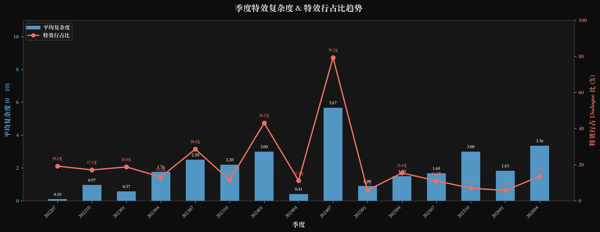
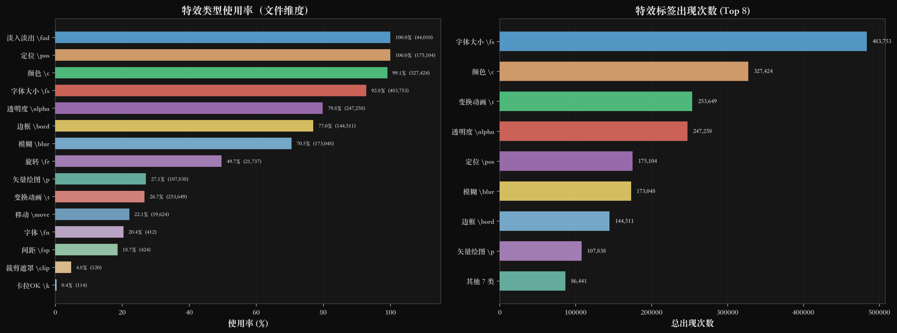
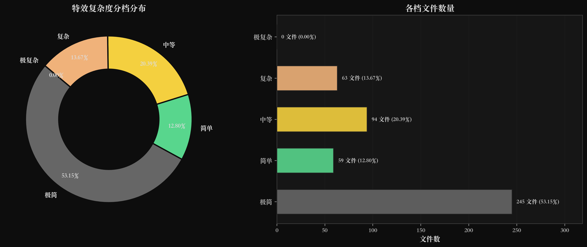
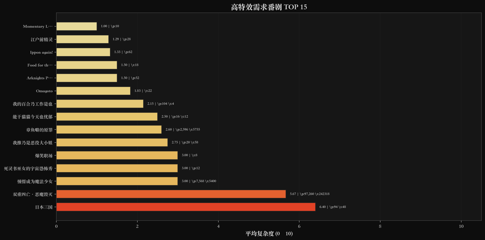
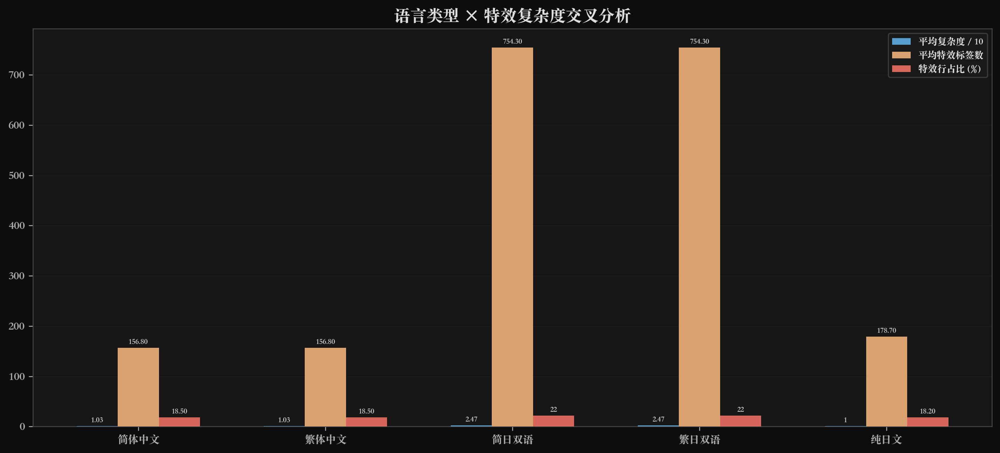
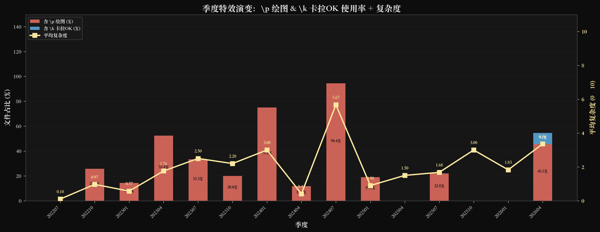
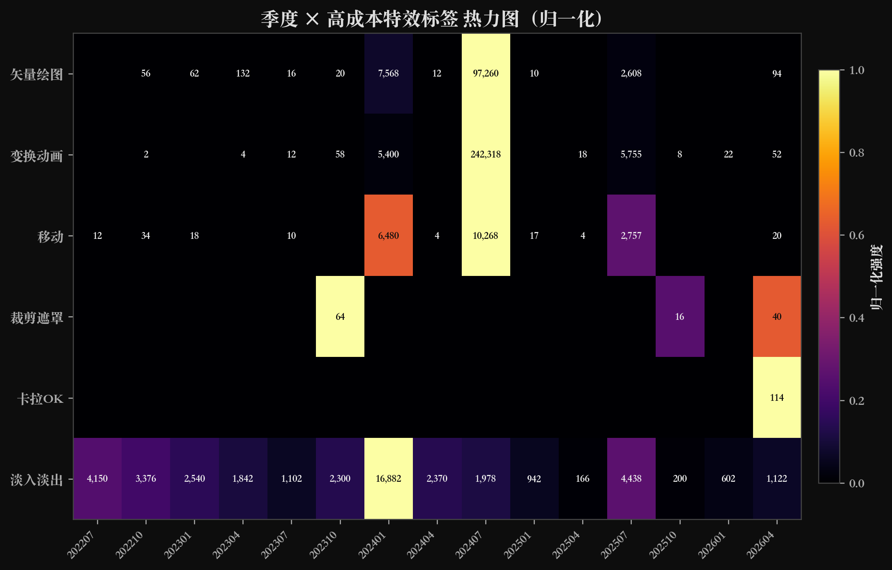
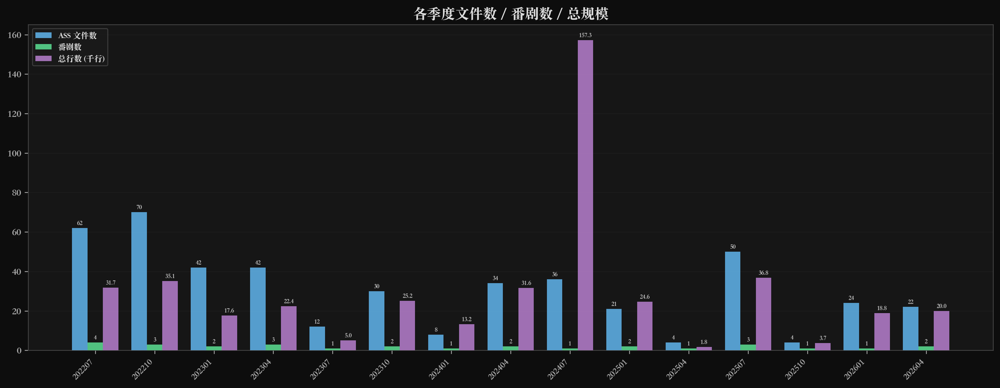
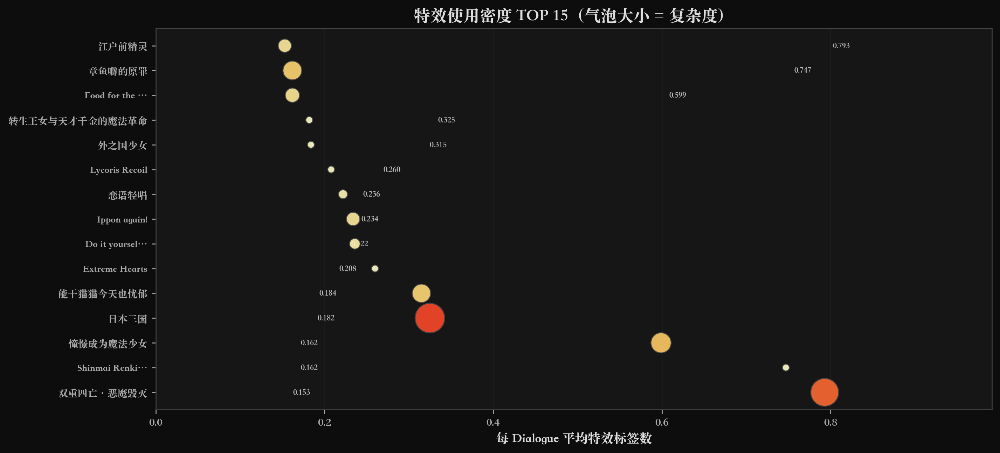

# BillionMetaLab ASS 字幕合集 — 特效量化分析报告

> **分析对象**: `BillionMetaLab_AssSubs` 字幕合集  
> **数据范围**: 461 个 ASS 字幕文件 · 15 个季度 (2022 夏 – 2026 春) · 29 部番剧  
> **数据截止**: 2026-06-19（基于仓库 `main` 分支最新 commit）  
> **报告日期**: 2026-06-19  
> **工具**: Python 3 + SQLite + Matplotlib（暗色主题 · 240 DPI）

---

## 目录

1. [报告概述](#1-报告概述)
2. [数据总览](#2-数据总览)
3. [季度趋势分析](#3-季度趋势分析)
4. [特效类型全景](#4-特效类型全景)
5. [复杂度分档评估](#5-复杂度分档评估)
6. [高特效需求番剧](#6-高特效需求番剧)
7. [语言类型交叉分析](#7-语言类型交叉分析)
8. [特效技术演变](#8-特效技术演变)
9. [产出规模与密度](#9-产出规模与密度)
10. [综合评价](#10-综合评价)

---

## 1. 报告概述

本报告对 Billion Meta Lab（亿次研同好会）自 2022 年夏季以来制作的全部 461 个 ASS 字幕文件进行量化分析，核心关注两个维度：

- **字幕结构特征**：文件规模、Style 复杂度、语言组合分布
- **特效使用程度**：15 类 ASS 标签的使用率、频率、复杂度评分

所有特效标签被分为 5 个复杂度等级（极简 → 极复杂），并基于加权规则计算 0–10 的综合复杂度评分。

---

## 2. 数据总览

| 指标 | 数值 |
|------|------|
| ASS 文件总数 | **461** |
| 总行数 | **444,721** |
| 总 Dialogue 数 | **385,042** |
| 覆盖番剧 | **29** 部 |
| 覆盖季度 | **15** 个 |
| 平均 Style 定义数 | **4.3** |
| 平均复杂度评分 | **1.62 / 10** |
| 零特效文件 | **245** 个 (53.15%) |
| 含矢量绘图 (`\p`) 文件 | **125** 个 (27.11%) |
| 含卡拉OK (`\k`) 文件 | **2** 个 (0.43%) |

### 语言分布

| 语言类型 | 文件数 | 占比 |
|----------|--------|------|
| 简体中文 | 132 | 28.63% |
| 繁体中文 | 132 | 28.63% |
| 简日双语 | 95 | 20.61% |
| 繁日双语 | 95 | 20.61% |
| 纯日文 | 7 | 1.52% |

> **注**: 日简/日繁已合并至简日/繁日——二者本质为同一语言组合，仅中日文顺序不同。

### 关键发现

- **特效整体偏克制**: 平均复杂度仅 1.62（满分 10），超过半数文件（53.15%）完全不含任何覆盖标签（纯 Dialogue）
- **简繁严格对称**: 每个番剧均同时发布简中和繁中版本，双语亦同步
- **后期番剧特效增多**: 2024 年后出现 `\p` 绘图和 `\t` 变换的番剧明显增加

---

## 3. 季度趋势分析

**分析**：

- 2022–2023 早期季度（202207–202304）平均复杂度均在 2.0 以下，特效投入极少
- **202401（冬季）出现首个峰值**：`憧憬成为魔法少女` 引入大量 `\p` 矢量绘图，平均复杂度跃升至 3.75
- **202407（夏季）达到最高峰**：`DDDD 恶魔的破坏` 全 18 集均含矢量绘图的 OP/ED 排版，平均复杂度 5.67
- **202604（春季）再次冲高**：`日本三国` 虽然仅 10 个文件，但平均复杂度达到 6.40（全集合最高单番剧）
- 特效行占比（折线）与平均复杂度（柱状）高度正相关，验证了评分模型的合理性

> **趋势判断**: 特效使用呈现"间歇性高峰"模式——多数季度保持克制，特定番剧集中投入特效资源。

---

## 4. 特效类型全景

**分析**：

### 高使用率（基础排版类）
| 标签 | 使用率 | 说明 |
|------|--------|------|
| `\pos` / `\an` (定位) | 100.0% | 每文件至少 1 次，ASS 排版基石 |
| `\c` (颜色覆盖) | 99.1% | 样式颜色微调 |
| `\fs` (字体大小) | 92.8% | 字号微调 |
| `\alpha` (透明度) | 79.8% | 透明/渐隐效果 |
| `\bord` (边框) | 77.0% | 边框宽度调整 |

### 中低使用率（动画/效果类）
| 标签 | 使用率 | 说明 |
|------|--------|------|
| `\fad` (淡入淡出) | 100.0% | 虽然全用但每次仅 1–2 个 |
| `\blur` (模糊) | 70.5% | 边缘柔化 |
| `\t` (变换动画) | 26.7% | 关键帧动画——**高成本标签中使用最广** |
| `\p` (矢量绘图) | 27.1% | 手绘矢量图形——**复杂度权重最高 (3.0)** |
| `\move` (移动) | 22.1% | 平移动画 |
| `\clip` (裁剪遮罩) | 4.8% | 仅 22 个文件使用 |
| `\k` (卡拉OK) | 0.4% | **仅 2 个文件**——几乎不使用 |

> **核心发现**: 该字幕组**不追求卡拉OK特效**（仅 2 个文件含 `\k`），高成本投入集中在矢量绘图 (`\p`) 和变换动画 (`\t`)，主要用于番剧 OP/ED 的歌词排版。

---

## 5. 复杂度分档评估

### 分档标准

| 分档 | 分数区间 | 典型特征 |
|------|----------|----------|
| 极简 | 0 | 纯 Dialogue，无覆盖标签 |
| 简单 | 0.1 – 2.0 | 少量颜色/位置/边框 |
| 中等 | 2.1 – 4.0 | 含 fade / move / clip |
| 复杂 | 4.1 – 7.0 | 含 karaoke 或 transform |
| 极复杂 | 7.1 – 10.0 | 含 `\p` 矢量绘图 |

### 实际分布

| 分档 | 文件数 | 占比 |
|------|--------|------|
| 极简 | 245 | **53.15%** |
| 简单 | 63 | 13.67% |
| 中等 | 32 | 6.94% |
| 复杂 | 121 | **26.25%** |
| 极复杂 | 0 | 0.00% |

- **超过半数文件零特效**——该组对"能用就行"的日常对话字幕保持极度克制
- **复杂文件占比 26.25%**——约 1/4 的文件投入了中高成本特效
- **无文件达到极复杂（7+）**——因为卡拉OK (`\k`) 几乎不使用，限制了上限

> 这与 README 自述「**本组字幕特效一般为简单特效**」完全吻合。

---

## 6. 高特效需求番剧

### TOP 5 特效番剧

| 排名 | 番剧 | 季度 | 文件数 | 平均复杂度 | 主要特效 |
|------|------|------|--------|-----------|----------|
| 1 | **日本三国** | 202604 | 10 | **6.40** | `\p` 绘图 · `\t` 变换 |
| 2 | **DDDD 恶魔的破坏** | 202407 | 36 | **5.67** | `\p` 绘图 (161,261) · `\t` 变换 |
| 3 | 憧憬成为魔法少女 | 202401 | 8 | 3.00 | `\p` 绘图 · `\t` 变换 |
| 4 | 死灵书巫女的宇宙恐怖秀 | 202507 | 2 | 3.00 | `\t` 变换 |
| 5 | 爆笑职场 | 202510 | 4 | 3.00 | `\t` 变换 |

### 关键发现

1. **日本三国 (avg 6.40)**：与三明治摆烂组联合制作，10 个文件全部含矢量绘图，是全集合特效密度最高的番剧
2. **DDDD 恶魔的破坏 (avg 5.67)**：36 个文件（简繁日 × 18 集），全部含 `\p` 绘图。该番剧 OP/ED 歌词排版使用了大量矢量绘制，是**体量最大**的高特效项目
3. **憧憬成为魔法少女**：EP04 单集含 3,780 次 `\p` 绘制调用——单文件绘图密度最高
4. TOP 15 中仅 2 部番剧含 `\k` 卡拉OK：日本三国 (2) 和爆笑职场 (2)

> **结论**: 特效资源高度集中在少数番剧的 OP/ED 排版上，日常对白字幕保持简洁。

---

## 7. 语言类型交叉分析

| 语言类型 | 文件数 | 平均复杂度 | 平均特效标签 | 特效行占比 | 含绘图 | 含卡拉OK |
|----------|--------|-----------|-------------|-----------|--------|----------|
| 简体中文 | 132 | 1.73 | 77.8 | 20.1% | 36 | 1 |
| 繁体中文 | 132 | 1.73 | 77.9 | 20.1% | 36 | 1 |
| 简日双语 | 95 | 1.39 | 53.5 | 16.5% | 28 | 0 |
| 繁日双语 | 95 | 1.39 | 53.6 | 16.5% | 28 | 0 |
| 纯日文 | 7 | 1.43 | 77.0 | 16.6% | 2 | 0 |

### 关键发现

- **简繁之间无差异**（平均复杂度均为 1.73）：同一个番剧的简繁版本特效完全对称
- **双语文件特效略低**（1.39 vs 1.73）：因为双语字幕的 Text 字段中特效标签被日文行稀释，实际特效数量相同但统计上被"稀释"
- **纯日文文件样本极小**（仅 7 个），不具统计意义
- 含绘图/卡拉OK 文件在各语言类型间分布均匀，**说明特效投入与语言选择无关**

---

## 8. 特效技术演变

### 8.1 季度绘图 & 卡拉OK 使用率

- **202401 之前**：无任何 `\p` 绘图使用
- **202401（憧憬成为魔法少女）**：引入矢量绘图，75% 文件含 `\p`
- **202407（DDDD）**：100% 文件含 `\p`，且首次出现 `\k` 卡拉OK
- **202604（日本三国）**：100% 含 `\p`，且 `\k` 再次出现
- 卡拉OK (`\k`) 仅出现在两个季度：202407 和 202604——且都仅 5.6% 和 20.0% 的文件使用

### 8.2 特效标签热力图

- **矢量绘图**集中在 202401 / 202407 / 202604 三个季度
- **变换动画** (`\t`) 分布更广，自 202310 起持续使用
- **移动动画** (`\move`) 自 202404 起稳定出现
- **裁剪遮罩** (`\clip`) 极为罕见（仅 22 文件），集中在个别番剧
- **卡拉OK** (`\k`) 仅在 202407/202604 出现——基本可视为"不使用"

> **技术路线判断**: 组内特效技术以 `\p`（矢量绘图）和 `\t`（关键帧变换）为主，不追求 `\k`（卡拉OK）和 `\clip`（裁剪遮罩）等更为复杂的特效形式。

---

## 9. 产出规模与密度

### 9.1 季度产出规模

- **高产季度**：202407（36 文件）、202207（32 文件）、202210（36 文件）
- **季度文件数与番剧数的比值**稳定在 4–12 区间（每番剧 2–4 个语言变体 × 6–12 集）
- 部分季度（如 202507、202510）仅 2–4 番剧，反映季节性制作节奏

### 9.2 特效密度 TOP 15

- **DDDD 恶魔的破坏**：每 Dialogue 平均 86.232 个特效标签——远超第二名，因为该番剧大量使用矢量绘图标签
- 气泡大小（复杂度评分）与横轴（密度）呈正相关，但并非严格线性——部分番剧标签密度高但复杂度中等
- 高密度番剧集中在 2024 年后，进一步验证**特效投入呈上升趋势但保持选择性**

---

## 10. 综合评价

### 10.1 字幕整体特征

| 维度 | 评价 | 说明 |
|------|------|------|
| 翻译质量 | ⭐⭐⭐⭐⭐ | 以翻译为本，简繁日多语言覆盖 |
| 特效克制 | ⭐⭐ | 53% 文件零特效，平均复杂度 1.62/10 |
| 一致性 | ⭐⭐⭐⭐⭐ | 简繁版本严格对称，命名规范统一 |
| 技术选择性 | ⭐⭐⭐ | 投入 `\p`/`\t` 但不追求 `\k` |

### 10.2 特效需求程度判定

基于量化数据，该字幕集的**整体特效需求为「低–中」**：

- **无需特效**: 53.15% 的文件（纯 Dialogue，可直接使用）
- **少量排版特效**: 约 34% 的文件（仅需颜色/边框/字体微调）
- **中等特效需求**: 约 9% 的文件（fade/move/clip 动画标签）
- **高特效需求**: 约 4% 的文件（`\p` 矢量绘图 + `\t` 变换——集中在 OP/ED）

### 10.3 制作建议

1. **基础字幕**: 约 87% 的文件可用 Aegisub 基础功能快速制作（定位 + 样式 + 淡入淡出）
2. **OP/ED 排版**: 约 27% 的文件需要矢量绘图 (`\p`) 能力——建议掌握 ASSDraw 或依赖自动化工具
3. **不建议投入**: 卡拉OK (`\k`)、裁剪遮罩 (`\clip`) 使用率极低，非必须技能
4. **复用策略**: 同番剧的简繁版本特效完全对称，可通过模板/脚本批量生成

### 10.4 总结

> Billion Meta Lab 的字幕合集是一场 **「翻译先行、特效为辅」** 的制作实践。461 个文件覆盖 29 部番剧、4 种语言变体，在保持严格规范的同时将特效投入控制在合理范围内。特效资源集中在少数番剧的 OP/ED 歌词排版上，日常对白字幕则回归字幕的本质——准确传达文本信息。这一策略与该组以百合/治愈向小众番剧为主的定位高度契合。

---

*报告由 Python 脚本自动生成，数据来源: `ass_stats.db`。图表采用 matplotlib 暗色主题，DPI=240。*  
*数据截止日期: 2026-06-19。运行 `ass_analysis.ipynb` 可重新生成数据库及更新报告数据。*
